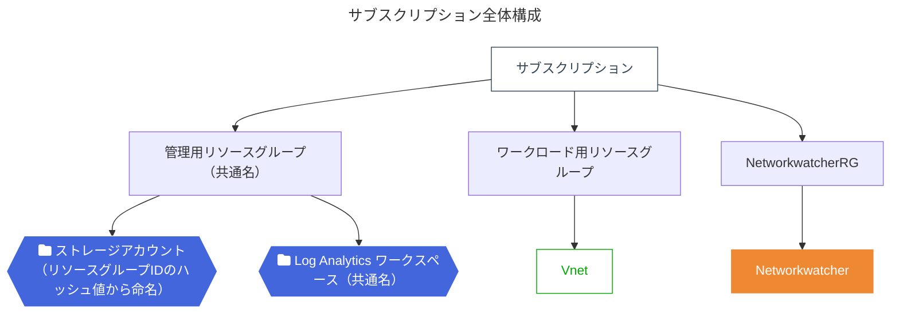

# 概要
Auzre Policy で Vnet フローログを作成します
参考にした組み込みポリシーは `3e9965dc-cc13-47ca-8259-a4252fd0cf7b` です

# 目的
組み込みポリシー `3e9965dc-cc13-47ca-8259-a4252fd0cf7b` ではパラメーターにワークスペース ID や Storage Account、Network Watcher の名前を指定する必要があります。
環境ごとに異なる値を指定するため、複数環境で同じポリシーを適用する場合は、ポリシーの作成や適用が煩雑になります。

本カスタムポリシーでは、ワークスペース ID や Storage Account、Network Watcher の名前をパラメーターに指定することなく、ポリシーを適用することができます。

| パラメーター | 説明 |
|:-------------|:-----|
| `resourceGroupName` | ストレージアカウントとLog Analyticsワークスペースを保存するリソースグループ。本ポリシーを適用する環境ではすべて同じ名前とします |
| `networkWatcherName` | フローログを作成する Network Watcher の名前 |
| `storageAccountName` | リソース グループ ID からハッシュ値を利用して一意に決めます |
| `workspaceId` | フローログを保存する Log Analytics のワークスペース ID |

# Azure Policy のサンプル
| ファイル名 | 説明 |
|:-----------|:-----|
| VnetFlowLogCrossSubscription.json | カスタム ポリシーのサンプルです |

# ARM template
ARM template ファイル配下には、以下のファイルがあります。
| ファイル名 | 説明 |
|:-----------|:-----|
| custom_flowlog01_armtemplate.json | Bicep から作成したもの。VnetFlowLogCrossSubscription.json で利用 |

# Bicep
Bicep ファイル配下には、以下のファイルがあります。
| ファイル名 | 説明 |
|:-----------|:-----|
| storage.bicep | リソース グループ の ID からストレージアカウントを作成する Bicep |
| custom_flowlog01_armtemplate.bicep | モジュールを呼び出す Bicep。参考にした Azure Policy を踏襲 |
| nested_flowlogDeployment_flowlog.bicep | フローログを作成する Bicep |

# 使い方
1. Azure Policy でカスタム ポリシーを作成します
2. パラメーターに `resourceGroupName`、`networkWatcherName`、`Log Analyticsワークスペース名`、`リージョン` を指定し、ポリシーを適用します
    - 複数環境に利用できるので管理グループに適用するのがオススメです
3. ポリシーを割り当てたサブスクリプションに指定した リソースグループ、Log Analyticsワークスペース、ストレージアカウントを作成します
    - ストレージアカウントは Storage.bicep を利用して作成します

# 注意
Flow Log は Vnet と同じリージョンにあるストレージ アカウントに保存する必要があります  
本カスタム ポリシーではストレージアカウントが複数リージョンに対応していません  
ストレージアカウント名のサフィックスやプレフィックスにリージョン名を付与することで、複数リージョンに対応することができる想定です